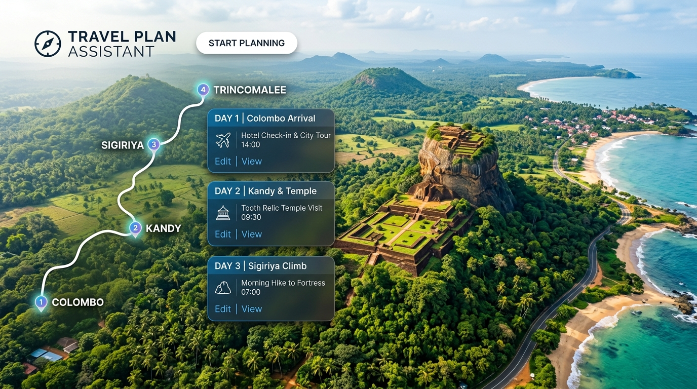

  <!-- HERO SECTION -->
  

    
  

  

    CO2060 Systems Design
    Status: Active MVP (Sprint 3 Complete)
    Team Phoenix
    React 19 &bull; Node.js &bull; MySQL
    Dept. of Computer Engineering, UoP
  

  <h1 style="font-weight: 800; color: #0f172a; margin-bottom: 0.5rem; letter-spacing: -0.02em;">
    Travel Plan Assistant
  </h1>
  

    An automated algorithmic itinerary generation engine and smart corridor travel companion designed to solve fragmented trip planning through graph-based routing, real-world geospatial intelligence, and dynamic schedule optimization.
  

  <!-- QUICK ACTION BUTTONS -->
  

    <a href="https://github.com/cepdnaclk/e22-co2060-travel-plan-assistant" target="_blank" class="tpa-btn tpa-btn-primary">
      <svg width="18" height="18" viewBox="0 0 24 24" fill="none" stroke="currentColor" stroke-width="2" stroke-linecap="round" stroke-linejoin="round"><path d="M9 19c-5 1.5-5-2.5-7-3m14 6v-3.87a3.37 3.37 0 0 0-.94-2.61c3.14-.35 6.44-1.54 6.44-7A5.44 5.44 0 0 0 20 4.77 5.07 5.07 0 0 0 19.91 1S18.73.65 16 2.48a13.38 13.38 0 0 0-7 0C6.27.65 5.09 1 5.09 1A5.07 5.07 0 0 0 5 4.77a5.44 5.44 0 0 0-1.5 3.78c0 5.42 3.3 6.61 6.44 7A3.37 3.37 0 0 0 9 18.13V22"></path></svg>
      GitHub Repository
    </a>
    <a href="https://cepdnaclk.github.io/e22-co2060-travel-plan-assistant" target="_blank" class="tpa-btn tpa-btn-secondary">
      <svg width="18" height="18" viewBox="0 0 24 24" fill="none" stroke="currentColor" stroke-width="2" stroke-linecap="round" stroke-linejoin="round"><circle cx="12" cy="12" r="10"></circle><line x1="2" y1="12" x2="22" y2="12"></line><path d="M12 2a15.3 15.3 0 0 1 4 10 15.3 15.3 0 0 1-4 10 15.3 15.3 0 0 1-4-10 15.3 15.3 0 0 1 4-10z"></path></svg>
      Project Page
    </a>
    <a href="http://www.ce.pdn.ac.lk/" target="_blank" class="tpa-btn tpa-btn-secondary">
      <svg width="18" height="18" viewBox="0 0 24 24" fill="none" stroke="currentColor" stroke-width="2" stroke-linecap="round" stroke-linejoin="round"><path d="M22 10v6M2 10l10-5 10 5-10 5z"></path><path d="M6 12v5c3 3 9 3 12 0v-5"></path></svg>
      Computer Engineering Dept.
    </a>
  

  

  <!-- TEAM SECTION -->
  <h2 id="team" style="font-weight: 700; color: #0f172a; margin-top: 1.5rem;">👥 Team Phoenix</h2>
  
Undergraduate Engineers &bull; Department of Computer Engineering, Faculty of Engineering, University of Peradeniya

  

    

      E/22/061
      
D.L.S.K. Dasanayaka

      <a class="tpa-member-email" href="mailto:e22061@eng.pdn.ac.lk">
        <svg width="14" height="14" viewBox="0 0 24 24" fill="none" stroke="currentColor" stroke-width="2"><path d="M4 4h16c1.1 0 2 .9 2 2v12c0 1.1-.9 2-2 2H4c-1.1 0-2-.9-2-2V6c0-1.1.9-2 2-2z"></path><polyline points="22,6 12,13 2,6"></polyline></svg>
        e22061@eng.pdn.ac.lk
      </a>
    

    

      E/22/074
      
W.Y.N. Dewshan

      <a class="tpa-member-email" href="mailto:e22074@eng.pdn.ac.lk">
        <svg width="14" height="14" viewBox="0 0 24 24" fill="none" stroke="currentColor" stroke-width="2"><path d="M4 4h16c1.1 0 2 .9 2 2v12c0 1.1-.9 2-2 2H4c-1.1 0-2-.9-2-2V6c0-1.1.9-2 2-2z"></path><polyline points="22,6 12,13 2,6"></polyline></svg>
        e22074@eng.pdn.ac.lk
      </a>
    

    

      E/22/233
      
T.S.P. Matharaarachchi

      <a class="tpa-member-email" href="mailto:e22233@eng.pdn.ac.lk">
        <svg width="14" height="14" viewBox="0 0 24 24" fill="none" stroke="currentColor" stroke-width="2"><path d="M4 4h16c1.1 0 2 .9 2 2v12c0 1.1-.9 2-2 2H4c-1.1 0-2-.9-2-2V6c0-1.1.9-2 2-2z"></path><polyline points="22,6 12,13 2,6"></polyline></svg>
        e22233@eng.pdn.ac.lk
      </a>
    

    

      E/22/253
      
G.T. Nethmina

      <a class="tpa-member-email" href="mailto:e22253@eng.pdn.ac.lk">
        <svg width="14" height="14" viewBox="0 0 24 24" fill="none" stroke="currentColor" stroke-width="2"><path d="M4 4h16c1.1 0 2 .9 2 2v12c0 1.1-.9 2-2 2H4c-1.1 0-2-.9-2-2V6c0-1.1.9-2 2-2z"></path><polyline points="22,6 12,13 2,6"></polyline></svg>
        e22253@eng.pdn.ac.lk
      </a>
    

  

  <!-- TABLE OF CONTENTS PILLS -->
  

    Quick Navigation:
    <a href="#introduction" class="section-nav-link">1. Introduction</a>
    <a href="#key-features" class="section-nav-link">2. Feature Matrix</a>
    <a href="#solution-architecture" class="section-nav-link">3. Solution Architecture</a>
    <a href="#software-designs" class="section-nav-link">4. Software & Algorithmic Designs</a>
    <a href="#current-progress" class="section-nav-link">5. Current Progress & Milestones</a>
    <a href="#testing" class="section-nav-link">6. Verification & Testing</a>
    <a href="#conclusion" class="section-nav-link">7. Conclusion & Roadmap</a>
    <a href="#links" class="section-nav-link">8. Links</a>
  

  <!-- 1. INTRODUCTION -->
  <h2 id="introduction" style="font-weight: 700; color: #0f172a; margin-top: 2rem;">1. Introduction</h2>
  
  

    

      Modern leisure and business travel requires synthesizing dozens of fragmented data sources: researching reputable attractions, estimating vehicular transit times, calculating realistic visit durations, booking roadside dining and lodging, and adjusting to rigid daily schedules. For multi-destination exploration (such as touring Sri Lanka's historical, coastal, and hill-country circuits), travelers frequently suffer from <strong>itinerary fatigue</strong>, sub-optimal travel corridors, and unrealistic time expectations.
    

    

      <strong>Travel Plan Assistant</strong> addresses this friction by providing an end-to-end, automated planning ecosystem. Rather than offering static point-to-point maps or uncurated listicles, the system leverages <strong>graph-based heuristic pathfinding</strong> to automatically generate balanced, multi-stop itineraries. Users define their origin, intended destinations, time budgets, and pacing preferences; the engine dynamically sequences the stops, calculates exact arrival and departure times, and seamlessly recommends verified hotels and restaurants precisely along the transit path.
    

    

      

        

          <strong style="color: #0f172a; font-size: 0.9rem;">Fragmented Discovery</strong>
          
Replaces 4+ disparate apps with an all-in-one synchronized planner.

        

      

      

        

          <strong style="color: #0f172a; font-size: 0.9rem;">Algorithmic Optimization</strong>
          
Bidirectional route search with 3 distinct pacing & transit variants.

        

      

      

        

          <strong style="color: #0f172a; font-size: 0.9rem;">Smart Corridor Amenities</strong>
          
Proximity-filtered accommodations and dining without detour overhead.

        

      

    

  

  <!-- 2. KEY FEATURES -->
  <h2 id="key-features" style="font-weight: 700; color: #0f172a; margin-top: 2rem;">2. Core Capabilities & Feature Matrix</h2>

  

    

      

        <svg width="20" height="20" viewBox="0 0 24 24" fill="none" stroke="#0284c7" stroke-width="2"><polyline points="22 12 18 12 15 21 9 3 6 12 2 12"></polyline></svg>
        Bidirectional Route Search
      

      

        Expands simultaneous forward and backward frontiers between origin and destination nodes, discovering optimal intermediate waypoints and generating 3 distinct styles: Shortest, Balanced, and Scenic.
      

    

    

      

        <svg width="20" height="20" viewBox="0 0 24 24" fill="none" stroke="#10b981" stroke-width="2"><circle cx="12" cy="12" r="10"></circle><polyline points="12 6 12 12 16 14"></polyline></svg>
        Dynamic Schedule Computation
      

      

        Auto-calculates transit duration, arrival times, and departure timestamps per stop while enforcing overall day-time budgets (e.g., 08:30 to 20:00) and user-customized dwell times.
      

    

    

      

        <svg width="20" height="20" viewBox="0 0 24 24" fill="none" stroke="#8b5cf6" stroke-width="2"><path d="M3 9l9-7 9 7v11a2 2 0 0 1-2 2H5a2 2 0 0 1-2-2z"></path><polyline points="9 22 9 12 15 12 15 22"></polyline></svg>
        Corridor Stays & Dining
      

      

        Integrates verified hotels and dining options directly adjacent to the travel corridor, displaying pricing tiers, ratings, opening hours, contact details, and web links.
      

    

    

      

        <svg width="20" height="20" viewBox="0 0 24 24" fill="none" stroke="#f59e0b" stroke-width="2"><polygon points="12 2 15.09 8.26 22 9.27 17 14.14 18.18 21.02 12 17.77 5.82 21.02 7 14.14 2 9.27 8.91 8.26 12 2"></polygon></svg>
        Interactive Plan Management
      

      

        Full customization UI allowing travelers to reorder stops, modify checkpoint visit times, save itineraries to multi-trip archives, and bookmark destinations in personalized wishlists.
      

    

    

      

        <svg width="20" height="20" viewBox="0 0 24 24" fill="none" stroke="#0284c7" stroke-width="2"><path d="M21 10c0 7-9 13-9 13s-9-6-9-13a9 9 0 0 1 18 0z"></path><circle cx="12" cy="10" r="3"></circle></svg>
        Geospatial Map Visualization
      

      

        Integrated interactive map visualizing route polylines, ordered stop pins, amenity badges, and interactive popups with direct navigation assistance.
      

    

    

      

        <svg width="20" height="20" viewBox="0 0 24 24" fill="none" stroke="#10b981" stroke-width="2"><rect x="3" y="11" width="18" height="11" rx="2" ry="2"></rect><path d="M7 11V7a5 5 0 0 1 10 0v4"></path></svg>
        Admin Portal & Monetization
      

      

        Role-based admin control for managing destination catalogs and reviewing user access, accompanied by subscription tiers (Free vs. Premium Voyager) with seamless checkout.
      

    

  

  <!-- DESTINATIONS SHOWCASE -->
  

    

      <svg width="20" height="20" viewBox="0 0 24 24" fill="none" stroke="#0284c7" stroke-width="2"><circle cx="12" cy="12" r="10"></circle><polygon points="16.24 7.76 14.12 14.12 7.76 16.24 9.88 9.88 16.24 7.76"></polygon></svg>
      <h4>Rich Sri Lankan Destination Repository</h4>
    

    

      Pre-loaded with verified spatial coordinates, district tags, imagery, and historical context across top travel regions:
    

    

      

        
        
Sigiriya Fortress

      

      

        
        
Kandy &amp; Heritage

      

      

        
        
Ella Mountains

      

      

        
        
Galle Dutch Fort

      

      

        
        
Nuwara Eliya

      

      

        
        
Mirissa Coastline

      

    

  

  <!-- 3. SOLUTION ARCHITECTURE -->
  <h2 id="solution-architecture" style="font-weight: 700; color: #0f172a; margin-top: 2rem;">3. Solution Architecture</h2>

  

    The system follows a decoupled, three-tier <strong>Client-Server &amp; Distributed Service Architecture</strong>. High-performance RESTful JSON APIs bridge the frontend React client with the Node.js business tier, MySQL spatial database, and external routing services.
  

  

    <svg viewBox="0 0 880 440" width="100%" height="auto" xmlns="http://www.w3.org/2000/svg">
      <defs>
        <linearGradient id="grad-fe" x1="0%" y1="0%" x2="100%" y2="100%">
          <stop offset="0%" stop-color="#0284c7"/>
          <stop offset="100%" stop-color="#0369a1"/>
        </linearGradient>
        <linearGradient id="grad-be" x1="0%" y1="0%" x2="100%" y2="100%">
          <stop offset="0%" stop-color="#0f172a"/>
          <stop offset="100%" stop-color="#1e293b"/>
        </linearGradient>
        <linearGradient id="grad-db" x1="0%" y1="0%" x2="100%" y2="100%">
          <stop offset="0%" stop-color="#059669"/>
          <stop offset="100%" stop-color="#047857"/>
        </linearGradient>
        <linearGradient id="grad-ext" x1="0%" y1="0%" x2="100%" y2="100%">
          <stop offset="0%" stop-color="#d97706"/>
          <stop offset="100%" stop-color="#b45309"/>
        </linearGradient>
        <filter id="shadow" x="-5%" y="-5%" width="110%" height="115%">
          <feDropShadow dx="0" dy="4" stdDeviation="4" flood-opacity="0.08"/>
        </filter>
      </defs>

      <!-- CLIENT LAYER -->
      <g filter="url(#shadow)">
        <rect x="20" y="20" width="220" height="390" rx="12" fill="#f8fafc" stroke="#cbd5e1" stroke-width="1.5"/>
        <rect x="20" y="20" width="220" height="42" rx="12" fill="url(#grad-fe)"/>
        <text x="130" y="47" fill="#ffffff" font-size="14" font-weight="700" text-anchor="middle">1. Client Layer (React 19)</text>
        
        <rect x="35" y="78" width="190" height="42" rx="6" fill="#ffffff" stroke="#e2e8f0"/>
        <text x="45" y="104" fill="#0f172a" font-size="12" font-weight="600">Dynamic Plan Generator</text>
        
        <rect x="35" y="130" width="190" height="42" rx="6" fill="#ffffff" stroke="#e2e8f0"/>
        <text x="45" y="156" fill="#0f172a" font-size="12" font-weight="600">Interactive Map (Leaflet)</text>
        
        <rect x="35" y="182" width="190" height="42" rx="6" fill="#ffffff" stroke="#e2e8f0"/>
        <text x="45" y="208" fill="#0f172a" font-size="12" font-weight="600">Itinerary Schedule Editor</text>
        
        <rect x="35" y="234" width="190" height="42" rx="6" fill="#ffffff" stroke="#e2e8f0"/>
        <text x="45" y="260" fill="#0f172a" font-size="12" font-weight="600">Destination Directory</text>

        <rect x="35" y="286" width="190" height="42" rx="6" fill="#ffffff" stroke="#e2e8f0"/>
        <text x="45" y="312" fill="#0f172a" font-size="12" font-weight="600">Wishlist &amp; Trip Sessions</text>

        <rect x="35" y="338" width="190" height="50" rx="6" fill="#e0f2fe" stroke="#bae6fd"/>
        <text x="45" y="360" fill="#0369a1" font-size="11" font-weight="700">Deployment: Vercel CDN</text>
        <text x="45" y="376" fill="#0284c7" font-size="10">Custom Domain &bull; Zero Lag</text>
      </g>

      <!-- ARROW 1 -->
      <path d="M 240 215 L 290 215" stroke="#0284c7" stroke-width="2.5" marker-end="url(#arrow)" stroke-dasharray="4,4"/>
      <polygon points="295,215 285,210 285,220" fill="#0284c7"/>
      <text x="268" y="200" fill="#0284c7" font-size="10" font-weight="700" text-anchor="middle">HTTPS</text>
      <text x="268" y="235" fill="#64748b" font-size="9" text-anchor="middle">REST / JSON</text>

      <!-- BACKEND ENGINE LAYER -->
      <g filter="url(#shadow)">
        <rect x="300" y="20" width="280" height="390" rx="12" fill="#f8fafc" stroke="#cbd5e1" stroke-width="1.5"/>
        <rect x="300" y="20" width="280" height="42" rx="12" fill="url(#grad-be)"/>
        <text x="440" y="47" fill="#ffffff" font-size="14" font-weight="700" text-anchor="middle">2. Engine &amp; API (Node / Express)</text>
        
        <rect x="315" y="78" width="250" height="44" rx="6" fill="#ffffff" stroke="#e2e8f0"/>
        <text x="325" y="98" fill="#0f172a" font-size="12" font-weight="700">plannerService</text>
        <text x="325" y="113" fill="#64748b" font-size="10">Bidirectional heuristic search (3 styles)</text>
        
        <rect x="315" y="132" width="250" height="44" rx="6" fill="#ffffff" stroke="#e2e8f0"/>
        <text x="325" y="152" fill="#0f172a" font-size="12" font-weight="700">itineraryService</text>
        <text x="325" y="167" fill="#64748b" font-size="10">Timeline timestamps &amp; duration limits</text>
        
        <rect x="315" y="186" width="250" height="44" rx="6" fill="#ffffff" stroke="#e2e8f0"/>
        <text x="325" y="206" fill="#0f172a" font-size="12" font-weight="700">hotel &amp; restaurantService</text>
        <text x="325" y="221" fill="#64748b" font-size="10">Corridor-based amenity lookup</text>

        <rect x="315" y="240" width="250" height="44" rx="6" fill="#ffffff" stroke="#e2e8f0"/>
        <text x="325" y="260" fill="#0f172a" font-size="12" font-weight="700">auth &amp; adminController</text>
        <text x="325" y="275" fill="#64748b" font-size="10">JWT, role guards, user approval flow</text>

        <rect x="315" y="294" width="250" height="44" rx="6" fill="#ffffff" stroke="#e2e8f0"/>
        <text x="325" y="314" fill="#0f172a" font-size="12" font-weight="700">subscriptionService</text>
        <text x="325" y="329" fill="#64748b" font-size="10">Premium checkout &amp; tier entitlements</text>

        <rect x="315" y="348" width="250" height="44" rx="6" fill="#f1f5f9" stroke="#cbd5e1"/>
        <text x="325" y="367" fill="#334155" font-size="11" font-weight="700">Host: DigitalOcean Ubuntu VPS</text>
        <text x="325" y="382" fill="#64748b" font-size="10">PM2 Daemon &bull; Low Latency Pool</text>
      </g>

      <!-- ARROW 2: TO DATABASE -->
      <path d="M 580 140 L 640 140" stroke="#059669" stroke-width="2.5"/>
      <polygon points="645,140 635,135 635,145" fill="#059669"/>
      <text x="612" y="130" fill="#059669" font-size="9" font-weight="700" text-anchor="middle">SQL Query</text>

      <!-- DATABASE LAYER -->
      <g filter="url(#shadow)">
        <rect x="650" y="20" width="210" height="215" rx="12" fill="#f8fafc" stroke="#cbd5e1" stroke-width="1.5"/>
        <rect x="650" y="20" width="210" height="42" rx="12" fill="url(#grad-db)"/>
        <text x="755" y="47" fill="#ffffff" font-size="13" font-weight="700" text-anchor="middle">3. MySQL Spatial DB</text>

        <rect x="665" y="74" width="180" height="28" rx="4" fill="#ffffff" stroke="#e2e8f0"/>
        <text x="675" y="93" fill="#0f172a" font-size="11" font-weight="600">&bull; destinations (Spatial POINT)</text>

        <rect x="665" y="108" width="180" height="28" rx="4" fill="#ffffff" stroke="#e2e8f0"/>
        <text x="675" y="127" fill="#0f172a" font-size="11" font-weight="600">&bull; nearby_destinations (Edges)</text>

        <rect x="665" y="142" width="180" height="28" rx="4" fill="#ffffff" stroke="#e2e8f0"/>
        <text x="675" y="161" fill="#0f172a" font-size="11" font-weight="600">&bull; hotels &amp; restaurants</text>

        <rect x="665" y="176" width="180" height="45" rx="4" fill="#ffffff" stroke="#e2e8f0"/>
        <text x="675" y="195" fill="#0f172a" font-size="11" font-weight="600">&bull; users, sessions, wishlists</text>
        <text x="675" y="210" fill="#64748b" font-size="10">Zero cold-start VPS engine</text>
      </g>

      <!-- ARROW 3: TO EXTERNAL APIS -->
      <path d="M 580 300 L 640 300" stroke="#d97706" stroke-width="2.5"/>
      <polygon points="645,300 635,295 635,305" fill="#d97706"/>
      <text x="612" y="290" fill="#d97706" font-size="9" font-weight="700" text-anchor="middle">External HTTP</text>

      <!-- EXTERNAL SERVICES LAYER -->
      <g filter="url(#shadow)">
        <rect x="650" y="250" width="210" height="160" rx="12" fill="#f8fafc" stroke="#cbd5e1" stroke-width="1.5"/>
        <rect x="650" y="250" width="210" height="42" rx="12" fill="url(#grad-ext)"/>
        <text x="755" y="277" fill="#ffffff" font-size="13" font-weight="700" text-anchor="middle">4. External Integrations</text>

        <rect x="665" y="304" width="180" height="30" rx="4" fill="#ffffff" stroke="#e2e8f0"/>
        <text x="675" y="324" fill="#0f172a" font-size="11" font-weight="600">Google Distance Matrix API</text>

        <rect x="665" y="340" width="180" height="30" rx="4" fill="#ffffff" stroke="#e2e8f0"/>
        <text x="675" y="360" fill="#0f172a" font-size="11" font-weight="600">Google Places / Geocoding</text>

        <rect x="665" y="376" width="180" height="26" rx="4" fill="#fef3c7" stroke="#fde68a"/>
        <text x="675" y="394" fill="#b45309" font-size="10" font-weight="600">Real-time distance &amp; traffic</text>
      </g>
    </svg>

    

      
 Client View Tier

      
 Core Express API &amp; Algorithmic Services

      
 MySQL Spatial Relational Database

      
 External Routing &amp; Geospatial Services

    

  

  <!-- 4. SOFTWARE DESIGNS -->
  <h2 id="software-designs" style="font-weight: 700; color: #0f172a; margin-top: 2rem;">4. Software &amp; Algorithmic Designs</h2>

  

    <h3 style="font-size: 1.2rem; font-weight: 700; color: #0f172a; margin-bottom: 0.75rem;">
      4.1 Graph-Based Bidirectional Route Optimization
    </h3>
    

      At the heart of the Travel Plan Assistant is an algorithmic bidirectional expansion engine. Traditional single-source Dijkstra or TSP approaches often incur exponential search spaces when evaluating multi-criteria geographic networks. To generate intuitive travel sequences across regional nodes, the system applies <strong>bidirectional search</strong> with separate forward and backward visited sets to prevent false cycle detection:
    

    

      <table class="tpa-table">
        <thead>
          <tr>
            <th>Route Style</th>
            <th>Algorithmic Selection Strategy</th>
            <th>Neighbor Distance Threshold</th>
            <th>Primary Use Case</th>
          </tr>
        </thead>
        <tbody>
          <tr>
            <td><strong>Shortest (Direct)</strong></td>
            <td>Selects closest neighbor (rank 0) along directional vector toward destination</td>
            <td><code>distance &le; 25 km</code></td>
            <td>Fastest transit, minimal fuel consumption, business travel</td>
          </tr>
          <tr>
            <td><strong>Balanced (Average)</strong></td>
            <td>Selects median-ranked candidate neighbor: <code>index = floor((len - 1)/2)</code></td>
            <td><code>distance &le; 25 km</code></td>
            <td>Balanced discovery, blending primary highways with popular towns</td>
          </tr>
          <tr>
            <td><strong>Scenic (Longest)</strong></td>
            <td>Selects farthest valid candidate neighbor: <code>index = len - 1</code></td>
            <td><code>distance &le; 25 km</code></td>
            <td>Leisure exploration, coastal/mountain scenic routes, maximum attractions</td>
          </tr>
        </tbody>
      </table>
    

    

      Directional filtering (<code>directionalService.js</code>) utilizes vector angle bounds between the current candidate and destination coordinates to guarantee forward geographic momentum and avoid backtrack loops.
    

  

  

    <h3 style="font-size: 1.2rem; font-weight: 700; color: #0f172a; margin-bottom: 0.75rem;">
      4.2 Corridor-Based Amenity Extraction
    </h3>
    

      Unlike naive radius searches that recommend hotels 30 km in the opposite direction, the <code>hotelService</code> and <code>restaurantService</code> utilize <strong>bounding corridors</strong> along the sequence of itinerary legs.
    

    <ul>
      <li><strong>Separation of Concerns:</strong> Hotels and dining spots are tagged distinctly from primary tourist attractions, preventing administrative confusion in the graph engine.</li>
      <li><strong>Rich Amenity Attributes:</strong> Stores price levels (<code>$</code> to <code>$$$$</code>), opening hours, user ratings, photo URLs, cuisine types, phone numbers, and official websites.</li>
      <li><strong>On-Path Presentation:</strong> The frontend renders accommodation options directly below each day leg, enabling 1-click booking navigation.</li>
    </ul>
  

  

    <h3 style="font-size: 1.2rem; font-weight: 700; color: #0f172a; margin-bottom: 0.75rem;">
      4.3 Database Schema &amp; Spatial Modeling
    </h3>
    

      The MySQL relational schema leverages native spatial data types (<code>POINT</code>, <code>lat</code>, <code>lng</code>) for millisecond-fast distance calculations:
    

    

      <table class="tpa-table">
        <thead>
          <tr>
            <th>Table Name</th>
            <th>Primary Keys / Indices</th>
            <th>Core Attributes</th>
            <th>Purpose</th>
          </tr>
        </thead>
        <tbody>
          <tr>
            <td><code>destinations</code></td>
            <td><code>destinationID</code> (PK), Spatial (POINT)</td>
            <td>name, lat, lng, description, photos, rating, display_picture, type</td>
            <td>Attraction repository across districts</td>
          </tr>
          <tr>
            <td><code>nearby_destinations</code></td>
            <td>Composite (source_id, destination_id)</td>
            <td>distance_km, duration_mins, road_condition</td>
            <td>Graph edges connecting nodes</td>
          </tr>
          <tr>
            <td><code>hotels</code></td>
            <td><code>hotel_id</code> (PK), destination_id (FK)</td>
            <td>name, lat, lng, price_level, hotel_type, phone, website, photos</td>
            <td>Accommodations along travel corridors</td>
          </tr>
          <tr>
            <td><code>restaurants</code></td>
            <td><code>restaurant_id</code> (PK), destination_id (FK)</td>
            <td>name, lat, lng, cuisine_type, price_level, opening_hours</td>
            <td>Dining spots along routes</td>
          </tr>
          <tr>
            <td><code>users</code></td>
            <td><code>user_id</code> (PK), email (UNIQUE)</td>
            <td>name, password (bcrypt), role, status, is_subscribed, preferences</td>
            <td>Authentication, RBAC &amp; profile settings</td>
          </tr>
          <tr>
            <td><code>user_travel_sessions</code></td>
            <td><code>session_id</code> (PK), user_id (FK)</td>
            <td>travel_plan (JSON), milestones, customDurations, created_at</td>
            <td>Stateful persistence of customized plans</td>
          </tr>
          <tr>
            <td><code>wishlists</code></td>
            <td><code>wishlist_id</code> (PK), UNIQUE(user_id, dest_id)</td>
            <td>destination_id, note, created_at</td>
            <td>User destination bookmarks</td>
          </tr>
        </tbody>
      </table>
    

  

  <!-- 5. CURRENT PROGRESS & MILESTONES -->
  <h2 id="current-progress" style="font-weight: 700; color: #0f172a; margin-top: 2rem;">5. Current Progress &amp; Milestones</h2>

  

    

      <svg width="20" height="20" viewBox="0 0 24 24" fill="none" stroke="#10b981" stroke-width="2"><path d="M22 11.08V12a10 10 0 1 1-5.93-9.14"></path><polyline points="22 4 12 14.01 9 11.01"></polyline></svg>
      <h4>Sprint Status &amp; Deliverables Completed</h4>
    

    

      <table class="tpa-table">
        <thead>
          <tr>
            <th>Module / Feature</th>
            <th>Implementation Details</th>
            <th>Status</th>
          </tr>
        </thead>
        <tbody>
          <tr>
            <td><strong>Algorithmic Path Engine</strong></td>
            <td>Bidirectional search supporting shortest, average, and scenic route styles</td>
            <td>&check; Completed</td>
          </tr>
          <tr>
            <td><strong>Corridor Stays &amp; Dining</strong></td>
            <td>Hotel and restaurant catalog populated with geo-corridor queries</td>
            <td>&check; Completed</td>
          </tr>
          <tr>
            <td><strong>Interactive Itinerary Editor</strong></td>
            <td>Stop reordering, custom dwell durations, and schedule recalculation</td>
            <td>&check; Completed</td>
          </tr>
          <tr>
            <td><strong>Interactive Map View</strong></td>
            <td>Dynamic Leaflet map integration displaying route polylines and markers</td>
            <td>&check; Completed</td>
          </tr>
          <tr>
            <td><strong>User Auth &amp; Saved Trips</strong></td>
            <td>JWT authentication, user status approval, wishlist bookmarking</td>
            <td>&check; Completed</td>
          </tr>
          <tr>
            <td><strong>Admin Dashboard</strong></td>
            <td>User management (approve/reject) and destination CRUD administration</td>
            <td>&check; Completed</td>
          </tr>
          <tr>
            <td><strong>Premium Subscriptions</strong></td>
            <td>Subscription flow, tier management, and subscriber-only features</td>
            <td>&check; Completed</td>
          </tr>
          <tr>
            <td><strong>Production Deployment</strong></td>
            <td>Frontend deployed on Vercel; Backend &amp; DB on DigitalOcean VPS</td>
            <td>&check; Completed</td>
          </tr>
          <tr>
            <td><strong>Public Transit Integration</strong></td>
            <td>Sri Lanka Railway schedule overlay and multi-modal transit options</td>
            <td>&bull; Planned (Sprint 4)</td>
          </tr>
        </tbody>
      </table>
    

  

  <!-- 6. TESTING -->
  <h2 id="testing" style="font-weight: 700; color: #0f172a; margin-top: 2rem;">6. Verification &amp; Testing</h2>

  

    

      Testing prioritized both functional verification of graph heuristics and non-functional guarantees regarding API latency, session security, and data integrity:
    

    

      

        

          <h5 style="color: #0f172a; font-weight: 700; font-size: 0.95rem; margin-bottom: 0.4rem;">
            🔬 Algorithmic &amp; Graph Stress Testing
          </h5>
          

            Tested bidirectional expansion against 50+ origin-destination pairs. Validated frontier termination limits (max steps = 50), isolation of forward/backward visited sets, and verified that generated routes produce 0 disjoint sub-paths.
          

        

      

      

        

          <h5 style="color: #0f172a; font-weight: 700; font-size: 0.95rem; margin-bottom: 0.4rem;">
            🌐 External API Resilience &amp; Caching
          </h5>
          

            Benchmarked Google Distance Matrix API calls with fallback mock distance matrix. Enforced defensive timeouts and caching of repeated distance pairs in <code>nearby_destinations</code> table to minimize external quota consumption.
          

        

      

      

        

          <h5 style="color: #0f172a; font-weight: 700; font-size: 0.95rem; margin-bottom: 0.4rem;">
            🛡️ Security &amp; RBAC Validation
          </h5>
          

            Verified JWT signature expiration, bcrypt salt rounds (10), protected route guards in React Router, and strict role segregation between standard travelers and system administrators.
          

        

      

      

        

          <h5 style="color: #0f172a; font-weight: 700; font-size: 0.95rem; margin-bottom: 0.4rem;">
            ⚡ End-to-End Latency &amp; Zero Cold-Start
          </h5>
          

            Hosted on dedicated Ubuntu VPS to prevent serverless cold starts. Database query times for corridor queries maintained under <strong>35ms</strong>; full 3-style itinerary generation completed in <strong>&lt; 650ms</strong>.
          

        

      

    

  

  <!-- 7. CONCLUSION -->
  <h2 id="conclusion" style="font-weight: 700; color: #0f172a; margin-top: 2rem;">7. Conclusion &amp; Future Roadmap</h2>

  

    

      The <strong>Travel Plan Assistant (MVP)</strong> successfully validates that graph-based bidirectional pathfinding combined with real-world geospatial intelligence can eliminate the friction of multi-stop travel planning. By unifying route optimization, dynamic scheduling, interactive stop modification, and corridor-based accommodation discovery into a cohesive platform, Team Phoenix has delivered a production-ready system with immediate practical value.
    

    <h5 style="color: #0f172a; font-weight: 700; font-size: 1rem; margin-top: 1rem;">Future Enhancements:</h5>
    <ul style="color: #475569; font-size: 0.9rem;">
      <li><strong>Multi-Modal Transit Integration:</strong> Incorporating Sri Lanka train schedules (e.g., scenic Kandy-to-Ella railway) alongside private vehicular routing.</li>
      <li><strong>Live Weather &amp; Monsoon Alerts:</strong> Dynamic route rerouting during adverse weather conditions.</li>
      <li><strong>Collaborative Group Planning:</strong> Real-time shared itinerary editing via WebSockets.</li>
      <li><strong>AI Personalization Engine:</strong> Preference-based ML ranking tailored to user travel history and budget sensitivity.</li>
    </ul>
  

  <!-- 8. LINKS -->
  <h2 id="links" style="font-weight: 700; color: #0f172a; margin-top: 2rem;">8. Links &amp; References</h2>

  

    

      

        <ul style="list-style: none; padding-left: 0; margin-bottom: 0;">
          <li style="margin-bottom: 8px;">
            🔗 <a href="https://github.com/cepdnaclk/e22-co2060-travel-plan-assistant" target="_blank" style="font-weight: 600; color: #0284c7;">Project GitHub Repository</a>
          </li>
          <li style="margin-bottom: 8px;">
            🌐 <a href="https://cepdnaclk.github.io/e22-co2060-travel-plan-assistant" target="_blank" style="font-weight: 600; color: #0284c7;">Project GitHub Pages Site</a>
          </li>
        </ul>
      

      

        <ul style="list-style: none; padding-left: 0; margin-bottom: 0;">
          <li style="margin-bottom: 8px;">
            🏛️ <a href="http://www.ce.pdn.ac.lk/" target="_blank" style="font-weight: 600; color: #0284c7;">Department of Computer Engineering</a>
          </li>
          <li style="margin-bottom: 8px;">
            🎓 <a href="https://eng.pdn.ac.lk/" target="_blank" style="font-weight: 600; color: #0284c7;">Faculty of Engineering, University of Peradeniya</a>
          </li>
        </ul>
      

    

  

